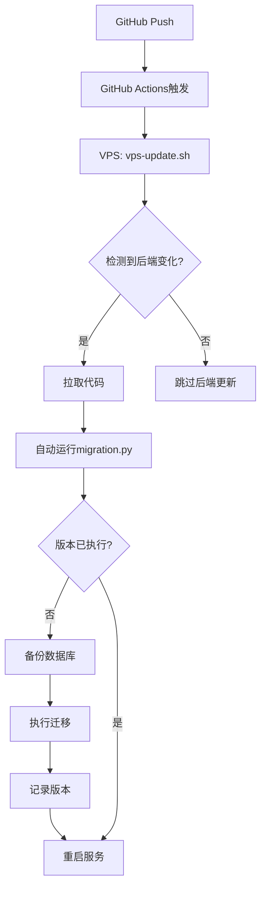

# 📚 数据库迁移系统完全指南

## 🎯 核心理念
**一次编写，永久自动** - 数据库变更只需修改一个文件，部署时自动执行。

## 🏗️ 系统架构

### 文件结构
```
backend/
├── migrations/
│   └── migration.py      # 唯一的迁移文件（不断更新）
├── data/
│   ├── research_dashboard_dev.db   # 开发数据库
│   └── research_dashboard_prod.db  # 生产数据库
```

## 🔄 完整自动化流程

### 1. 开发阶段


### 2. 自动部署流程


## 📝 使用方法

### 1. 添加新的数据库变更

**步骤1**: 修改版本号
```python
# 原来
MIGRATION_VERSION = "v1.11_add_literature_folders"

# 改为
MIGRATION_VERSION = "v1.12_add_new_feature"
```

**步骤2**: 在 `run_migration()` 函数中添加迁移代码
```python
# ===========================================
# 🔧 v1.12迁移任务：添加新功能
# ===========================================

logger.info("开始执行v1.12迁移...")

# 1. 创建新表
cursor.execute("""
    CREATE TABLE IF NOT EXISTS new_table (
        id INTEGER PRIMARY KEY,
        ...
    )
""")

# 2. 修改现有表
cursor.execute("ALTER TABLE existing_table ADD COLUMN new_column TEXT")

# 3. 数据迁移
cursor.execute("UPDATE ... SET ...")

logger.info("✅ v1.12迁移完成")
```

**步骤3**: 提交并推送
```bash
git add backend/migrations/migration.py
git commit -m "feat: Add v1.12 migration for new feature"
git push
```

### 2. 版本号命名规范
```
v{主版本}.{次版本}_{简短描述}

示例：
- v1.11_add_literature_folders
- v1.12_add_user_preferences
- v1.13_optimize_indexes
```

## 🛡️ 安全机制

### 1. 版本控制
```python
# migration_history 表结构
CREATE TABLE migration_history (
    id INTEGER PRIMARY KEY AUTOINCREMENT,
    version TEXT UNIQUE,              -- 防止重复执行
    executed_at DATETIME DEFAULT CURRENT_TIMESTAMP
)
```

### 2. 自动备份
```python
# 每次迁移前自动备份
backup_path = f"{db_path}.backup.{datetime.now().strftime('%Y%m%d_%H%M%S')}"
```

### 3. 环境隔离
```python
# 根据环境变量选择数据库
environment = os.environ.get('ENVIRONMENT', 'production')
```

## 🔍 迁移状态检查

### 查看已执行的迁移
```bash
# 在VPS上
cd /var/www/research-dashboard/backend
sqlite3 data/research_dashboard_prod.db "SELECT * FROM migration_history;"
```

### 手动执行迁移（仅调试用）
```bash
cd backend
python3 migrations/migration.py
```

## ⚠️ 注意事项

### 1. **永远不要**
- ❌ 创建多个迁移文件
- ❌ 删除或修改已执行的迁移代码
- ❌ 重复使用版本号

### 2. **始终要**
- ✅ 在迁移前测试SQL语句
- ✅ 使用 `IF NOT EXISTS` 等安全语句
- ✅ 保持迁移代码的幂等性

### 3. **最佳实践**
```python
# 检查表是否存在
cursor.execute("SELECT name FROM sqlite_master WHERE type='table' AND name='table_name'")
if not cursor.fetchone():
    cursor.execute("CREATE TABLE ...")

# 检查字段是否存在
cursor.execute("PRAGMA table_info(table_name)")
columns = [col[1] for col in cursor.fetchall()]
if 'new_column' not in columns:
    cursor.execute("ALTER TABLE ...")
```

## 🚀 Ultra Think 优势

1. **零人工干预** - Push代码即完成所有操作
2. **防错设计** - 版本控制防止重复执行
3. **可追溯性** - 所有变更有记录
4. **容错恢复** - 自动备份保证安全
5. **环境智能** - 自动识别开发/生产环境

## 📊 示例：完整的迁移案例

```python
# v1.11 添加文献文件夹功能的迁移
if MIGRATION_VERSION == "v1.11_add_literature_folders":
    # 1. 创建新表
    cursor.execute("""
        CREATE TABLE literature_folders (
            id INTEGER PRIMARY KEY AUTOINCREMENT,
            name VARCHAR(100) NOT NULL,
            parent_id INTEGER,
            user_id INTEGER NOT NULL,
            ...
        )
    """)
    
    # 2. 修改现有表
    cursor.execute("ALTER TABLE literature ADD COLUMN folder_id INTEGER")
    
    # 3. 创建索引
    cursor.execute("CREATE INDEX idx_folder_user_id ON literature_folders(user_id)")
    
    # 4. 初始化数据
    cursor.execute("INSERT INTO literature_folders ...")
```

## 🎉 总结

这个系统让数据库迁移变得**简单、安全、自动化**。你只需要：

1. 修改 `migration.py`
2. 更新版本号
3. Git push

剩下的全部自动完成！这就是 **Ultra Think** 的威力！